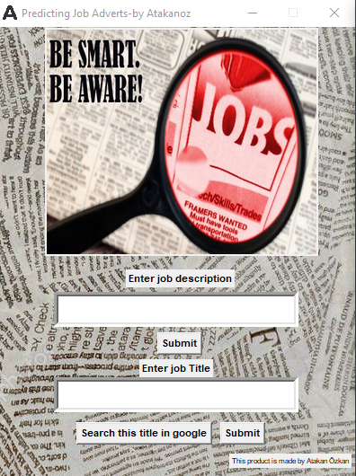
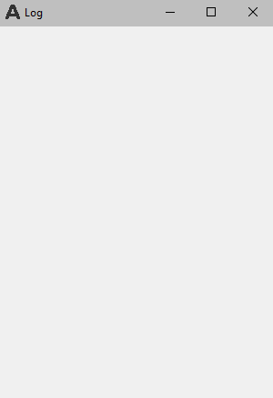

# Job-APP


This is the interface of the app. There is an AI behind it and output will tell you that, job advert is real or fraudulent.
This app is designed for ***windows*** and input should be ***English***!!



This is the log part. Every title and description is saved here. You can see them whenever you want.

Packages: 
```python
from sklearn.externals import joblib
import pandas as pd
import numpy as np
from PIL import Image
from wordcloud import WordCloud, STOPWORDS, ImageColorGenerator
import matplotlib.pyplot as plt
%matplotlib inline
import re
import nltk
nltk.download('stopwords')
from nltk.corpus import stopwords
from nltk.stem.porter import PorterStemmer
import seaborn as sn
from tkinter import *
import os 
os.system("clear")
from sklearn.feature_extraction.text import CountVectorizer
cv = CountVectorizer()
from sklearn.model_selection import train_test_split
import webbrowser
```

Button example: 

```python
def TitlePredict():  
    global n_des
    new_review = modelbox.get()
    massage_review = new_review
    modelbox.delete(0,"end")
    if massage_review == "":
        messagebox.showerror("Error","Please enter job advert description")
    else:
        new_review = re.sub('[^a-zA-Z]', ' ', new_review)
        new_review = new_review.lower()
        new_review = new_review.split()
        ps = PorterStemmer()
        all_stopwords = stopwords.words('english')
        all_stopwords.remove('not')
        new_review = [ps.stem(word) for word in new_review if not word in set(all_stopwords)]
        new_review = ' '.join(new_review)
        new_corpus = [new_review]
        new_X_test = cv2.transform(new_corpus).toarray()
        new_y_pred = model.predict(new_X_test)
        if new_y_pred == 1:
            messagebox.showerror("Description Hunter","Based on your job advert description, your job is Fraudulent!!!")
            massage_title = "{}) {} -->This description is Fraudulent!!!".format(n_des,massage_review)
            n_des += 1
            new_label = Label(new_window,text = massage_title, relief="solid")
            new_label.pack()
        else:
            messagebox.showinfo("Description Hunter","Based on your job advert description, your job is real and you can trust it :)")
            massage_title = "{}) {} -->This description is Real!".format(n_des,massage_review)
            n_des += 1
            new_label = Label(new_window,text = massage_title, relief="solid")
            new_label.pack()
```
